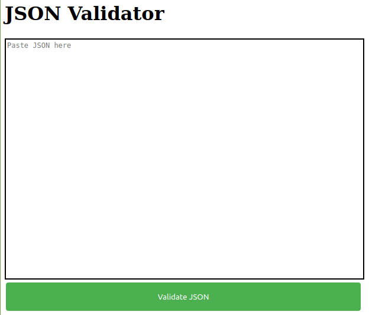

# JSON Validator

This a JSON Validator written in Go, it has a HTML frontend to paste JSON into with a button to check if your JSON is valid

## UI

## Usage

- `cd` into `/jsonValidator`
- run `go run jsonValidator.go` 
- navigate to `localhost:8080` to use the validator

It can also be built and ran in Docker using the provided docker image
